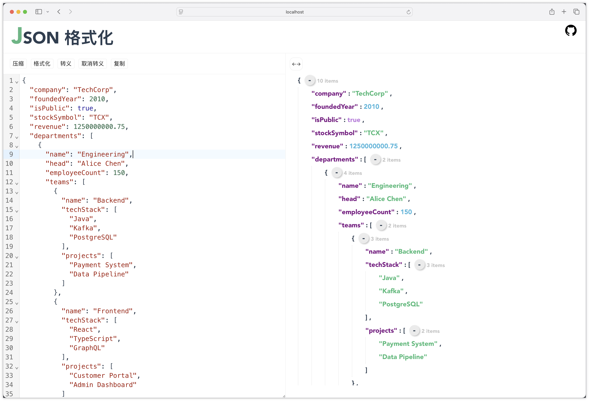

  

# JSON Formatter

A lite web app to format and preview json string.

**[Try it on line](https://bluesky335.github.io/json-formatter/)**

  

## Vue 3 + Typescript + Vite

This project is built with **[Vue 3](https://vuejs.org/) + [Typescript](https://www.typescriptlang.org/) + [Vite](https://vitejs.dev/)**

## Docker image

View at [Docker Hub](https://hub.docker.com/r/bluesky335/json-formatter)

## Recommended IDE Setup

- [VSCode](https://code.visualstudio.com/) + [Volar](https://marketplace.visualstudio.com/items?itemName=johnsoncodehk.volar)

## Start up

`npm install`

`npm run dev`

## License

[MIT License](./LICENSE)
